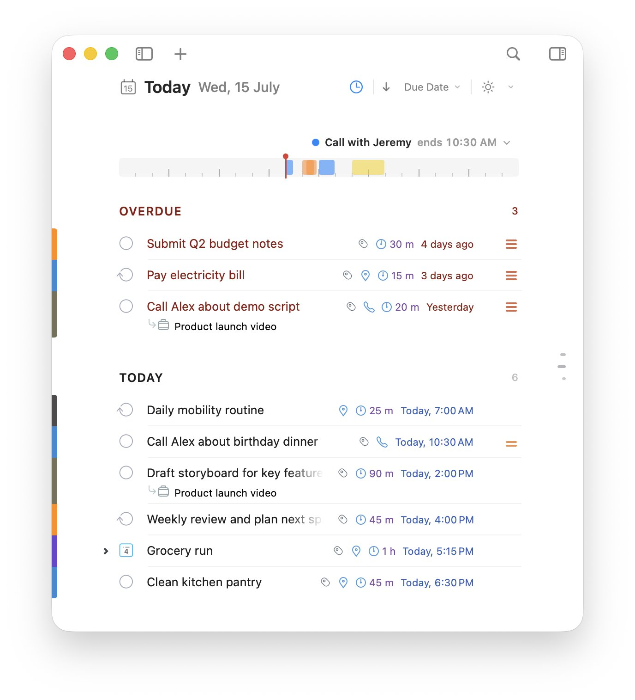
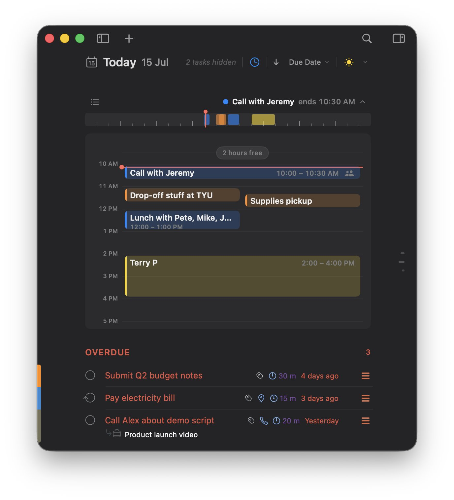

# Two Do

Two Do is a focused iOS time-blocking to-do list for turning a busy day into a clear plan. It keeps overdue work visible, places tasks on a daily timeline, and brings scheduled Google Calendar events into the same view.

## What it does

- Organizes work into overdue, today, upcoming, and undated task sections.
- Supports due dates, scheduled time blocks, notes, projects, tags, flags, locations, phone details, and subtasks.
- Provides an hourly Schedule view that combines Two Do tasks with read-only Google Calendar events.
- Searches tasks by title, project, and notes.
- Sends local notifications for due dates and scheduled blocks.
- Syncs task data across devices with SwiftData and the private CloudKit database when iCloud is available, with a local fallback for unsigned or simulator environments.
- Includes configurable home-screen widgets for focus, today, and upcoming tasks.

## Built with

- SwiftUI
- SwiftData
- CloudKit private database sync
- WidgetKit and App Intents
- Google Calendar OAuth 2.0 with PKCE
- XCUITest smoke tests
